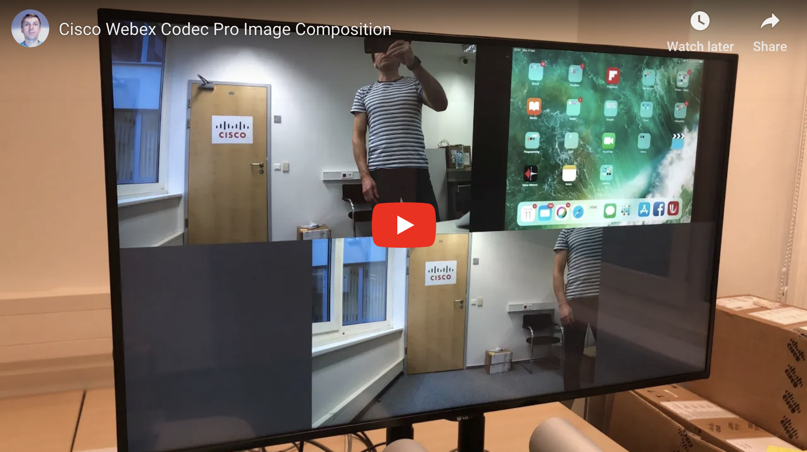
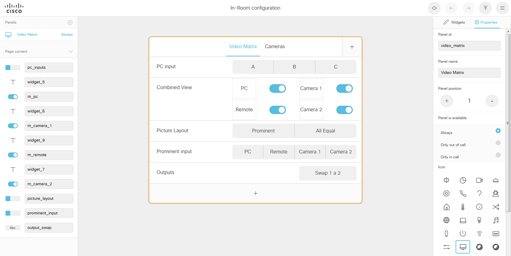

## Image Composition
CE9.6 introduced the capability to combine multiple inputs (local or remote) to a composite picture. Depending on the codec model, up to four HDMI inputs can be combined. Remote video streams can be added as well. The picture layout can be either "Equal" (all video streams of the same size) or "Prominent" (one video large, the rest small at the bottom of the screen). Both layouts have fixed proportions. It is not possible to configure position and dimensions of each video stream.

There are actually two sets of commands for video composition:
* **xCommand Video Matrix ...** commands are used for local composition. Multiple inputs are combined into a single display output. In this case the codec works as an HDMI cross-connect.
* **xCommand Video Input SetMainVideoSource ...** command is used for an image composition for remote viewers. The viewers will see a combined video in the main video channel.

For more details about the commands refer to the [documentation](https://www.cisco.com/c/dam/en/us/td/docs/telepresence/endpoint/ce96/collaboration-endpoint-software-api-reference-guide-ce96.pdf).

You can see the example in action here:  

## In Room Control Widgets
[roomcontrolconfig_en.xml](./roomcontrolconfig_en.xml) file can be uploaded to a codec's In-Room Control Editor (Integration->In-Room Control, Launch Editor).  
  
The image composition is controlled by **Video Matrix** tab. The **Cameras** tab is an additional example of custom camera controls.  

Each widget has a unique id (for example `m_pc` or `output_swap`). When touched, the widget generates an action which consists of the action **type** and **value**. Depending on the widget, different action types are created. For example a **Toggle** widget generates  **changed** type and **value** of `on` and `off`. Sometimes it's sufficient to read just the action value (for example **Toggle** widget). In other cases it's better to read the action type. For example **Button** widget generates types **pushed**, **released** and **clicked**. When developing an in-room-control handler it's best to log all events and decide which should be used and which can be ignored.

## Macro
[matrix.js](./matrix.js) file can be uploaded to a codec's macro editor. It's a JavaScript engine which runs on the codec itself, no external application servers are required. The engine is based on [JSXAPI](https://github.com/cisco-ce/jsxapi). So although I haven't tested it the `PictureLayout` and `CameraControl` classes can be used also for remote control via SSH or Web API of the codec. Documentation and other resources can be found on [Cisco DevNet](https://developer.cisco.com/codeexchange/github/repo/CiscoDevNet/awesome-xapi/).

[matrix.js](./matrix.js) consists of three sections:
1. definition of `PictureLayout` class
2. definition of `CameraControl` class
3. `touchFeedback` handler of In-room Control widget events  
The classes use the XAPI to control the codec - set the local and remote picture layout or move and zoom the cameras.

## Installation

1. open In-Room Control Editor and upload the widget definition [roomcontrolconfig_en.xml](./roomcontrolconfig_en.xml) using [=] menu on the right side and **Import from file**.
2. verify the widget layout and do **Export to video system**
3. check that you can open the widgets on the Touch10 of the video system
4. open Macro Editor and upload the [matrix.js](./matrix.js) using **Import from file**
5. activate the macro
6. connect some HDMI inputs to the video system and at least one display

You are now ready to test the widgets, try switching some inputs on, check that they appear on the display. Use macro editor console for debugging.

## Authors & Maintainers

Smart people responsible for the creation and maintenance of this project:

- Jaroslav Martan <jmartan@cisco.com>

## License

This project is licensed to you under the terms of the [Cisco Sample Code License](./LICENSE).
